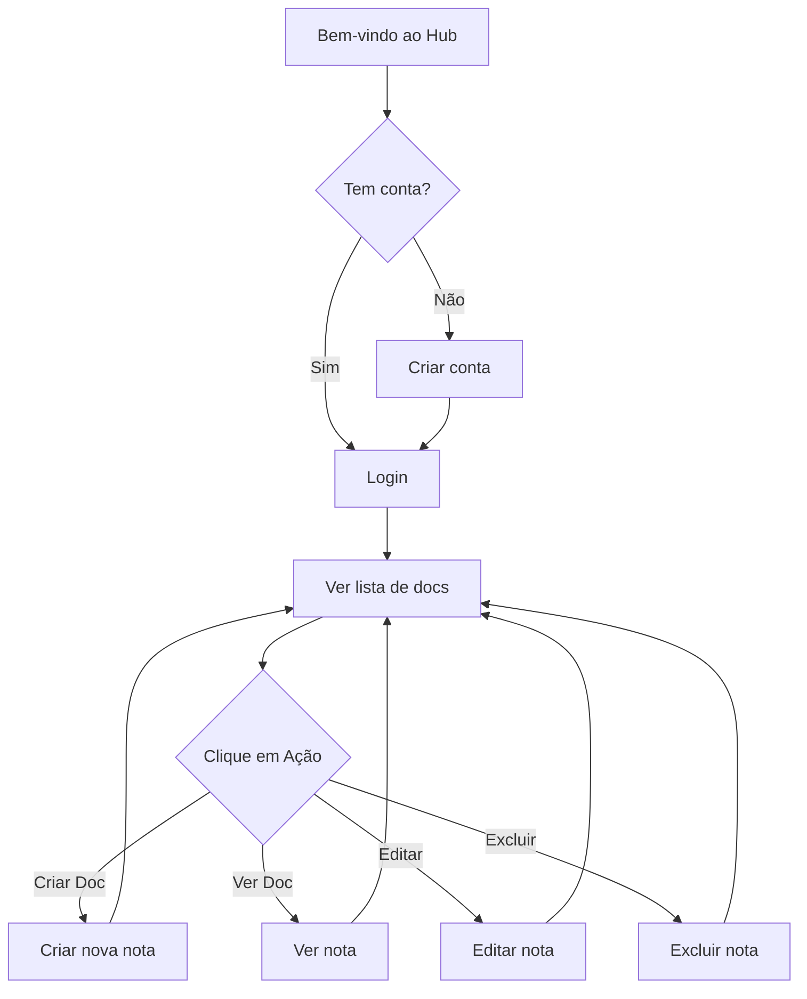

# PRD - Hub (Notas & Anotações)

**Documento:** Product Requirements Document (PRD)
**Produto:** Hub
**Versão:** 1.0
**Data:** 17/08/2026
**Autor:** Product Owner
**Status:** Em Desenvolvimento

---

## 1. Visão do Produto

O **Hub** é uma aplicação web para armazenamento e organização de anotações pessoais. O objetivo é otimizar a produtividade do usuário, armazenando suas anotações de forma simples e intuitiva — uma nota de cada vez.

> *"Your life's Work. Organized, always."*

### Problema que resolve
Profissionais, estudantes e criativos precisam de um espaço privado e simples para capturar pensamentos, ideias, tarefas e informações do dia a dia. Soluções existentes são excessivamente complexas ou não oferecem privacidade.

### Público-alvo
Pessoas que desejam um caderno digital pessoal para anotações rápidas, com foco em simplicidade e privacidade.

---

## 2. Objetivos & Métricas de Sucesso

| Objetivo | Métrica | Meta (MVP) |
|---|---|---|
| Aumentar retenção de usuários | % de usuários ativos após 7 dias | 40% |
| Engajamento com anotações | Notas criadas/usuário/mês | 15 |
| Satisfação do usuário | NPS (Net Promoter Score) | > 30 |
| Performance | Tempo de carregamento da página inicial | < 2s |

---

## 3. Personas

### 3.1. Persona Primária — "O Anotador"

| Atributo | Descrição |
|---|---|
| **Nome** | Maria |
| **Idade** | 28 anos |
| **Profissão** | Designer UX |
| **Objetivo** | Capturar ideias rápidas, briefings e anotações de reuniões |
| **Dores** | Apps complexos; perde notas em e-mail ou post-its |
| **Comportamento** | Usa celular e laptop; valoriza simplicidade e busca rápida |

### 3.2. Persona Secundária — "O Estudante"

| Atributo | Descrição |
|---|---|
| **Nome** | João |
| **Idade** | 22 anos |
| **Profissão** | Estudante de Engenharia |
| **Objetivo** | Anotar resumos, fórmulas e tarefas do dia |
| **Dores** | Perde anotações manuscritas; precisa de acesso em qualquer lugar |
| **Comportamento** | Usa principalmente laptop; precisa de organização por tema |

---

## 4. Jornada do Usuário

---

## 5. Escopo MVP (Mínimo Produto Viável)

> **Definição de MVP:** O conjunto mínimo de funcionalidades que entrega valor ao usuário e permite validação no mercado.

### Funcionalidades do MVP

| ID | Funcionalidade | Prioridade | Status Atual |
|---|---|---|---|
| M1 | Cadastro e login de usuário | Alta | ✅ Implementado |
| M2 | Criar uma nota (doc) | Alta | ✅ Implementado |
| M3 | Visualizar lista de notas | Alta | ✅ Implementado |
| M4 | Visualizar uma nota | Alta | ✅ Implementado |
| M5 | Editar uma nota | Alta | ✅ Implementado |
| M6 | Excluir uma nota | Alta | ✅ Implementado |
| M7 | Notas associadas ao usuário | Alta | ✅ Implementado |
| M8 | Layout responsivo com navegação | Média | ⚠️ Parcial |

### Pendências do MVP

| ID | Pendência | Prioridade | Descrição |
|---|---|---|---|
| P1 | Proteção de rotas | Crítica | `authenticate_user!` não está aplicado |
| P2 | Validações de modelo | Alta | User e Doc sem validações |
| P3 | Estilização completa | Alta | CSS vazio em arquivos globais |
| P4 | Correção de assets | Média | jQuery/Popper não pinnados no importmap |

---

## 6. Roadmap de Desenvolvimento

### 6.1. Sprint 1 — Estabilização do MVP (2 semanas)

**Objetivo:** Corrigir pendências críticas e entregar MVP sólido.

| Tarefa | Owner | Estimativa |
|---|---|---|
| Aplicar `before_action :authenticate_user!` em controllers | Backend | 1 dia |
| Adicionar validações de presença em `Doc` (title, content) | Backend | 1 dia |
| Adicionar validações em `User` (email, password) | Backend | 1 dia |
| Preencher estilos CSS básicos (global, docs, welcome) | Frontend | 3 dias |
| Corrigir importmap: pinnar jQuery e Popper | DevOps | 1 dia |
| Remover duplicate stylesheet_link_tag no layout | Frontend | 0.5 dia |
| Escrever testes de modelo e controller | QA/Backend | 2 dias |

### 6.2. Sprint 2 — Funcionalidades Essenciais (2 semanas)

**Objetivo:** Adicionar funcionalidades que aprofundam o valor do MVP.

| Tarefa | Owner | Estimativa |
|---|---|---|
| Busca/listagem com paginação | Backend/Frontend | 2 dias |
| Confirmação de exclusão (modal) | Frontend | 1 dia |
| Editor de texto rico (formatação básica) | Frontend | 3 dias |
| Mensagens de feedback (flash) aprimoradas | Frontend | 1 dia |
| Seed de dados para demonstração | Backend | 1 dia |
| Testes de sistema com Capybara | QA | 2 dias |

### 6.3. Sprint 3 — Aprimoramentos e Qualidade (2 semanas)

**Objetivo:** Refinamento de experiência e qualidade técnica.

| Tarefa | Owner | Estimativa |
|---|---|---|
| Tags/categorias para notas | Backend | 2 dias |
| Ordenação de notas (recentemente criadas/modificadas) | Backend | 1 dia |
| Tema escuro/claro | Frontend | 2 dias |
| Refatoração de códigos duplicados | Backend | 1 dia |
| Melhoria de acessibilidade (a11y) | Frontend | 1 dia |
| Documentação de API (rdoc) | Backend | 1 dia |
| Testes de integração completos | QA | 2 dias |

### 6.4. Sprint 4+ — Visão de Longo Prazo

| Funcionalidade | Justificativa |
|---|---|
| Colaboração em tempo real (compartilhamento de notas) | Expandir uso além individual |
| Exportação (PDF, Markdown, TXT) | Portabilidade de dados |
| Aplicativo mobile (PWA) | Acessibilidade em dispositivos móveis |
| Integração com calendário | Sinergia com gestão de tempo |
| Versão offline | Uso sem conexão |
| API pública | Extensibilidade para terceiros |

---

## 7. Requisitos Funcionais

### 7.1. Autenticação

| RF | Descrição |
|---|---|
| RF-01 | Usuário deve se cadastrar com email e senha |
| RF-02 | Usuário deve poder fazer login e logout |
| RF-03 | Usuário deve recuperar senha via email |
| RF-04 | Session deve persistir com "lembrar-me" |
| RF-05 | Todas as rotas de docs exigem autenticação |

### 7.2. Gestão de Notas (Docs)

| RF | Descrição |
|---|---|
| RF-06 | Usuário autenticado cria, lê, atualiza e deleta suas notas |
| RF-07 | Notas são filtradas pelo usuário autenticado (isolamento de dados) |
| RF-08 | Lista de notas exibe título, conteúdo resumido e data de criação |
| RF-09 | Visualização individual mostra conteúdo completo |
| RF-10 | Edição e exclusão exigem confirmação intencional |
| RF-11 | Notas devem ter título obrigatório |

### 7.3. Interface

| RF | Descrição |
|---|---|
| RF-12 | Interface responsiva (desktop e mobile) |
| RF-13 | Navegação intuitiva com header consistente |
| RF-15 | Feedback visual para ações (success, error) |
| RF-16 | Botão de ação flutuante ou visível para nova nota |

---

## 8. Requisitos Não-Funcionais

| ID | Categoria | Requisito |
|---|---|---|
| RNF-01 | Performance | Página carrega em < 2s (desktop 3G) |
| RNF-02 | Segurança | Dados do usuário isolados por escopo (user_id) |
| RNF-03 | Segurança | CSRF protection ativo (default Rails) |
| RNF-04 | Usabilidade | Tempo médio para criar primeira nota < 2 min |
| RNF-05 | Confiabilidade | Disponibilidade > 99% |
| RNF-06 | Manutenibilidade | Cobertura de testes > 70% |
| RNF-07 | Escalabilidade | Suporta 1.000 usuários simultâneos (estimativa futura) |
| RNF-08 | Portabilidade | Compatível com Chrome, Firefox, Safari (últimas 2 versões) |

---

## 9. Dependências

| Dependência | Tipo | Status |
|---|---|---|
| Ruby 3.3.0 | Runtime | ✅ Disponível |
| Rails 7.0.8 | Framework | ✅ Instalado |
| SQLite3 | Database | ✅ Local |
| Node.js + Yarn | Build Assets | ✅ Disponível |
| Bootstrap 5.3 | CSS Framework | ✅ Instalado |
| Devise | Auth | ✅ Instalado |
| Simple Form | Formulários | ✅ Instalado |

---

## 10. Riscos & Mitigações

| Risco | Impacto | Probabilidade | Mitigação |
|---|---|---|---|
| Atraso na proteção de rotas | Alto | Alta | Priorizar na Sprint 1 |
| Complexidade do editor de texto | Médio | Média | Começar com textarea simples |
| Baixa retenção de usuários | Alto | Média | Mensagens de boas-vindas + onboarding simples |
| Performance na listagem | Médio | Baixa | Paginação por padrão |
| Concorrência com Notion/Obsidian | Alto | Alta | Posicionar como alternativa minimalista |

---

## 11. Critérios de Aceitação (MVP)

O MVP está completo quando:

1. [ ] Usuário consegue se cadastrar e logar sem erros
2. [ ] Usuário autenticado consegue criar, ver, editar e deletar notas
3. [ ] Usuário NÃO consegue acessar rotas de docs sem estar logado
4. [ ] Cada usuário vê apenas suas próprias notas
5. [ ] Interface é funcional em desktop e mobile
6. [ ] Todas as ações retornam feedback visual claro

---

## 12. Glossário

| Termo | Definição |
|---|---|
| Doc / Nota | Unidade de conteúdo criada pelo usuário (model `Doc`) |
| User | Usuário registrado na plataforma (model `User` via Devise) |
| Wrapper | Classes CSS de layout (`.wrapper`, `.wrapper_with_padding`) |
| Simple Form | Gem para renderização de formulários Rails |
| Importmap | Gerenciador de pacotes JS padrão do Rails 7 |

---

*Este documento é vivo e será atualizado conforme o produto evolui.*
